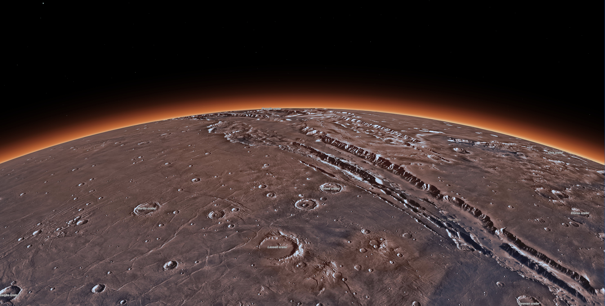

# Explore Mars

An interactive 3D web application showing the planet Mars, using the [ArcGIS Maps SDK for Javascript](https://developers.arcgis.com/javascript/). This is a non-commercial demo application made by the Esri R&D Center Zurich. It is intended for presentations or as a starting point for new projects.t for new projects.

[](https://esri.github.io/explore-mars)

The app uses multiple API features like [Elevation Profile](https://developers.arcgis.com/javascript/latest/api-reference/esri-widgets-ElevationProfile.html), [glTF import](https://developers.arcgis.com/javascript/latest/sample-code/import-gltf/index.html) and a [custom Spatial Reference](https://developers.arcgis.com/javascript/latest/api-reference/esri-geometry-SpatialReference.html).

On the technical side the app is built using [TypeScript](https://www.typescriptlang.org/), [npm](https://www.npmjs.com/) and [Vite](https://vitejs.dev/).

## Instructions

A live version is available [here](https://esri.github.io/explore-mars).

To run the source code locally, follow these steps:

```
git clone https://github.com/Esri/explore-mars.git
cd explore-mars/
npm install
npm run start # serves application at http://localhost:3000
```

For more details about running and deploying the application see our [development and deployment instructions](./DEVELOP_AND_DEPLOY.md).

## Resources

The following external libraries, APIs, open datasets and specifications were used to make this application:

- [ArcGIS Maps SDK for JavaScript](https://developers.arcgis.com/javascript/)
- [zip.js](https://gildas-lormeau.github.io/zip.js/) for extracting glTF models
- [Calcite Web](http://esri.github.io/calcite-web/)

## Disclaimer

This demo application is for illustrative purposes only and it is not maintained. There is no support available for deployment or development of the application.

## Contributing

Esri welcomes contributions from anyone and everyone. Please see our [guidelines for contributing](https://github.com/esri/contributing).

## Licensing

Copyright 2024 Esri

Licensed under the Apache License, Version 2.0 (the "License");
you may not use this file except in compliance with the License.
You may obtain a copy of the License at

http://www.apache.org/licenses/LICENSE-2.0

Unless required by applicable law or agreed to in writing, software
distributed under the License is distributed on an "AS IS" BASIS,
WITHOUT WARRANTIES OR CONDITIONS OF ANY KIND, either express or implied.
See the License for the specific language governing permissions and
limitations under the License.

A copy of the license is available in the repository's [license.txt](./license.txt) file.
